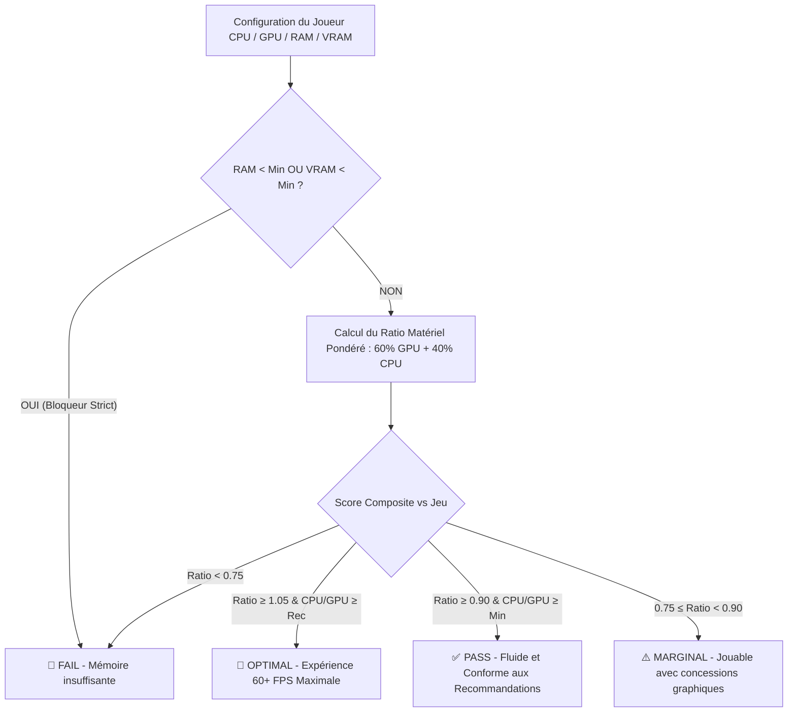

# 🎮 LANSmith (LAN Forge)

> **Plateforme Full-Stack d'Organisation de LAN Parties, Évaluation Hardware & Gestion de Tournois Multi-Jeux.**  
> Développé avec **Nuxt 3**, **TypeScript**, **Prisma ORM (SQLite)**, **Tailwind CSS**, l'API **IGDB v4** et l'**API Steam Store**.

---

## 🌟 Présentation du Projet

**LANSmith** est une solution tout-en-un conçue pour simplifier l'organisation d'événements gaming, de compétitions e-sport et de LAN parties. L'application combine un **moteur d'évaluation hardware en temps réel**, un **moteur de recherche intelligent de jeux vidéo** tolérant aux fautes de frappe et acronymes, et un **système complet de tournois multi-épreuves avec classements en direct**.

### Points Clés
- ⚡ **Moteur de Compatibilité Hardware :** Évaluation précise basée sur les benchmarks réels (CPU Mark, 3D Graphics Mark), ratios pondérés (60% GPU / 40% CPU) et bloqueurs stricts de RAM / VRAM (`OPTIMAL`, `PASS`, `MARGINAL`, `FAIL`).
- 🔍 **Moteur de Recherche de Jeux Multi-Stratégies (Inspiration FeedCraft) :** Recherche Apicalypse IGDB en 5 stratégies parallèles avec dictionnaire d'acronymes (`cs2`, `rl`, `aoe2`, `cod`, `l4d2`...), tolérance aux fautes de frappe (distance de Levenshtein), gestion des mots collés/séparés et filtrage anti-DLC.
- 🎮 **Enrichissement Steam & Hardware Automatique :** Détection automatique du Steam App ID, extraction des configurations minimales et recommandées depuis l'API Steam Store et matching instantané avec les scores de benchmark.
- 🏆 **Tournois Multi-Jeux & Leaderboard en Direct :** Création de compétitions multi-épreuves, choix du barème de points (Standard LAN, Formule 1), podium dynamique (Or, Argent, Bronze) et modal de saisie rapide des scores par manche.
- 🖥️ **Catalogue Hardware Massif :** Plus de **6 700 processeurs** et **2 900 cartes graphiques** issus des Mega Pages PassMark avec scores exacts et tiers calibrés (1 à 5).
- 🛠️ **Espace d'Administration Hardware :** Gestion CRUD complète des composants avec autocomplétion instantanée et filtres par tier.

---

## 🏗️ Architecture & Stack Technique

| Domaine | Technologies |
| :--- | :--- |
| **Framework Frontend & SSR** | [Nuxt 3](https://nuxt.com/) (Vue 3, Composition API, Script Setup) |
| **Serveur & API Routes** | [Nitro Engine](https://nitro.unjs.io/) (H3 Handlers, Type-safe Server Routes) |
| **Base de Données & ORM** | [Prisma ORM](https://www.prisma.io/) avec SQLite (`dev.db`) |
| **Langage** | [TypeScript](https://www.typescriptlang.org/) (Typage strict de bout en bout) |
| **Design & UI** | [Tailwind CSS](https://tailwindcss.com/), [Lucide Vue Next](https://lucide.dev/), Thème Cyberpunk / Dark Glow |
| **Web Scraping & Parsing** | [Cheerio](https://cheerio.js.org/) (Parsing HTML PassMark Mega Pages & Steam Requirements) |
| **APIs Externes** | Twitch OAuth2 + **IGDB API v4** + **Steam Store API** |

---

## 🔍 Moteur de Recherche Intelligent des Jeux

Inspiré de l'architecture de [FeedCraft](https://github.com/K0bus/feedcraft), le service [`server/utils/igdb.ts`](file:///home/k0bus/dev/web/lan_forge/server/utils/igdb.ts) implémente un système de recherche ultra-fiable articulé autour de 4 piliers :

1. **Dictionnaire d'Acronymes & Alias :** Résolution instantanée (`cs2` $\to$ `Counter-Strike 2`, `rl` $\to$ `Rocket League`, `aoe2` $\to$ `Age of Empires II`, `gta5` $\to$ `Grand Theft Auto V`, etc.).
2. **Multi-Stratégies Parallèles (`Promise.all`) :**
   - Requête textuelle directe IGDB (`search "..."`).
   - Requête avec tokens fusionnés (`v ris` $\to$ `vris`, `x com` $\to$ `xcom`).
   - Requête avec fractionnement des mots attachés (`eldenring` $\to$ `elden ring`).
   - Requête Apicalypse wildcard multi-tokens (`where name ~ *"token1"* & name ~ *"token2"*`).
   - Requête Apicalypse wildcard sur token signifiant triée par popularité (`rating_count desc`).
3. **Filtrage Anti-DLC (`isDLC`) :** Exclusion des DLCs, season passes, bandes originales et bundles pour garantir des résultats de jeux complets.
4. **Scoring de Pertinence & Ranking Hybride (`calculateRelevance`) :**
   - Score de similarité (Correspondance exacte > Préfixe > Inclusion de mots > Distance de Levenshtein pour les fautes de frappe).
   - Bonus de popularité IGDB (`rating_count` + `follows`).

---

## ⚙️ Moteur d'Évaluation de Compatibilité

Le moteur d'évaluation ([`server/utils/hardwareMatcher.ts`](file:///home/k0bus/dev/web/lan_forge/server/utils/hardwareMatcher.ts)) analyse les machines des participants selon 4 niveaux de statut :



### Règles de Calcul :
1. **Bloqueurs Stricts :** Si `Rig.ramGb < Game.minRamGb` ou `Rig.vramGb < Game.minVramGb`, le statut est immédiatement `FAIL`.
2. **Pondération des Composants :**  
   $$\text{Hardware Ratio} = \left(\frac{\text{Rig.gpuScore}}{\text{Game.recGpuScore}} \times 0.60\right) + \left(\frac{\text{Rig.cpuScore}}{\text{Game.recCpuScore}} \times 0.40\right)$$
3. **Statuts :**
   - **`OPTIMAL` (Cyan / Vert éclatant) :** Ratio $\ge 1.05$ et configuration au-delà des recommandations.
   - **`PASS` (Émeraude) :** Ratio $\ge 0.90$ et configuration validant les minimums.
   - **`MARGINAL` (Ambre) :** $0.75 \le \text{Ratio} < 0.90$, jouabilité acceptable avec concessions visuelles.
   - **`FAIL` (Rose / Rouge) :** Ratio $< 0.75$ ou blocage mémoire strict.

---

## 🗄️ Modèle de Données (Prisma Schema)

```prisma
// Joueurs / Participants
model Participant {
  id        String            @id @default(cuid())
  nickname  String            @unique
  avatarUrl String?
  createdAt DateTime          @default(now())
  updatedAt DateTime          @updatedAt
  rig       Rig?
  scores    TournamentScore[]
}

// Configuration PC du Joueur
model Rig {
  id            String      @id @default(cuid())
  participantId String      @unique
  participant   Participant @relation(fields: [participantId], references: [id], onDelete: Cascade)
  
  cpuName       String
  cpuNormalized String
  cpuScore      Int
  
  gpuName       String
  gpuNormalized String
  gpuScore      Int
  vramGb        Int
  
  ramGb         Int
  os            String      @default("Windows")
  
  createdAt     DateTime    @default(now())
  updatedAt     DateTime    @updatedAt
}

// Répertoire des Benchmarks CPU & GPU
model BenchmarkCpu {
  id         String   @id @default(cuid())
  name       String   @unique
  normalized String   @unique
  score      Int      // CPU Mark (Gaming/Single-Thread)
  tier       Int      // 1 (Entry) à 5 (Enthusiast)
  updatedAt  DateTime @updatedAt
}

model BenchmarkGpu {
  id         String   @id @default(cuid())
  name       String   @unique
  normalized String   @unique
  score      Int      // G3D Mark
  tier       Int      // 1 à 5
  updatedAt  DateTime @updatedAt
}

// Jeux Vidéo & Spécifications Requises
model Game {
  id          String            @id @default(cuid())
  igdbId      Int               @unique
  name        String
  slug        String
  coverUrl    String?
  summary     String?
  genres      String?
  
  // Spécifications de benchmark calibrées
  minCpuScore Int               @default(0)
  recCpuScore Int               @default(0)
  minGpuScore Int               @default(0)
  recGpuScore Int               @default(0)
  minRamGb    Int               @default(8)
  recRamGb    Int               @default(16)
  minVramGb   Int               @default(2)
  recVramGb   Int               @default(6)
  
  tournaments Tournament[]
  scores      TournamentScore[]
  createdAt   DateTime          @default(now())
}

// Tournois Multi-Jeux & Compétitions
model Tournament {
  id           String            @id @default(cuid())
  name         String
  status       String            @default("DRAFT") // DRAFT, IN_PROGRESS, COMPLETED
  scoringRules String?           // JSON array des points (ex: "[10,8,6,5,4,3,2,1]")
  games        Game[]
  scores       TournamentScore[]
  createdAt    DateTime          @default(now())
}

// Scores et Classements par Manche
model TournamentScore {
  id            String      @id @default(cuid())
  tournamentId  String
  tournament    Tournament  @relation(fields: [tournamentId], references: [id], onDelete: Cascade)
  participantId String
  participant   Participant @relation(fields: [participantId], references: [id], onDelete: Cascade)
  gameId        String
  game          Game        @relation(fields: [gameId], references: [id], onDelete: Cascade)
  
  rank          Int?
  rawScore      Float?
  points        Int         @default(0)
  
  createdAt     DateTime    @default(now())

  @@unique([tournamentId, participantId, gameId])
}
```

---

## 📂 Structure du Répertoire

```text
lan_forge/
├── assets/css/main.css           # Thème global, styles cyberpunk et glassmorphism
├── components/
│   ├── CompatibilityBadge.vue    # Badge visuel de compatibilité (OPTIMAL, PASS, MARGINAL, FAIL)
│   ├── GameModal.vue             # Modal d'ajout/édition de jeu avec recherche IGDB + Steam
│   ├── HardwareBadge.vue         # Badge matériel (CPU/GPU) avec score et tier
│   ├── ParticipantModal.vue      # Modal joueur avec autocomplétion hardware et scores exacts
│   └── ScoreEntryModal.vue       # Saisie et validation des scores de manche de tournoi
├── layouts/
│   └── default.vue               # Layout principal avec barre de navigation et footer
├── pages/
│   ├── index.vue                 # Dashboard central : statistiques, tournois actifs, joueurs
│   ├── games.vue                 # Gestionnaire de jeux vidéo et fiches de compatibilité
│   ├── participants.vue          # Liste des participants et configurations des rigs
│   ├── tournaments/
│   │   ├── index.vue             # Vue globale des tournois et création de compétition
│   │   └── [id].vue              # Page tournoi : leaderboard en direct, podium et scores
│   ├── hardware.vue              # Visualisation rapide des benchmarks
│   └── admin/
│       └── hardware.vue          # Administration complète des benchmarks CPU et GPU
├── prisma/
│   └── schema.prisma             # Schéma Prisma SQLite
├── scripts/
│   └── seed-hardware.ts          # Scraping haute performance PassMark Mega Pages (ALL entries)
├── server/
│   ├── api/
│   │   ├── compatibility/        # Endpoints de calcul direct et matrice de compatibilité
│   │   ├── games/                # CRUD jeux et recherche enrichie (/search.get.ts)
│   │   ├── hardware/             # CRUD benchmarks & recherche autocomplétion
│   │   ├── igdb/search.get.ts    # Recherche IGDB multi-stratégies avec enrichissement Steam
│   │   ├── participants/         # CRUD joueurs et rigs
│   │   └── tournaments/          # CRUD tournois, scores et leaderboards en direct
│   └── utils/
│       ├── hardwareMatcher.ts    # Moteur mathématique d'évaluation des configurations
│       ├── igdb.ts               # Client IGDB avec multi-stratégies, acronymes et anti-DLC
│       ├── steam.ts              # Extraction AppID, fetch Steam Store et parsing HTML
│       └── prisma.ts             # Client Prisma Singleton
├── shared/
│   ├── types/                    # Interfaces partagées Frontend / Backend
│   └── utils/
│       ├── compatibility.ts      # Helpers de calcul côté client
│       └── hardwareNormalizer.ts # Normalisation des désignations GPU / CPU
├── tests/
│   └── compatibility.test.ts     # Tests unitaires du moteur de compatibilité
├── nuxt.config.ts                # Configuration Nuxt 3 & Tailwind
└── package.json                  # Dépendances et scripts de démarrage
```

---

## 🚀 Installation & Démarrage

### 1. Prérequis
- **Node.js** $\ge 18.0.0$
- **npm** ou **pnpm**

### 2. Cloner et Installer les Dépendances
```bash
git clone <votre-repo> lan_forge
cd lan_forge
npm install
```

### 3. Variables d'Environnement (`.env`)
Créez un fichier `.env` à la racine :
```env
DATABASE_URL="file:./dev.db"
TWITCH_CLIENT_ID="votre_twitch_client_id"
TWITCH_CLIENT_SECRET="votre_twitch_client_secret"
NUXT_PUBLIC_APP_NAME="LANSmith"
```
*(Remarque : Si aucune clé Twitch n'est fournie, LANSmith bascule automatiquement sur sa bibliothèque de jeux LAN hors-ligne calibrée).*

### 4. Initialiser la Base de Données & le Hardware
```bash
# Synchroniser le schéma Prisma avec la base SQLite
npm run db:push

# Télécharger et indexer l'intégralité du catalogue PassMark Mega Pages (6700+ CPUs, 2900+ GPUs)
npm run hardware:seed
```

### 5. Lancer l'Application en Développement
```bash
npm run dev
```
L'application est accessible à l'adresse : **`http://localhost:3000`**

---

## 🧪 Tests Unitaires

Pour vérifier l'intégrité du moteur de compatibilité hardware :
```bash
npm test
```
*Valide les calculs de ratios, le déclenchement des bloqueurs stricts de mémoire et la normalisation des noms de composants.*

---

---

## 🐳 Déploiement avec Docker

L'application est entièrement conteneurisée avec un `Dockerfile` multi-stage optimisé (Node 22 Alpine, Prisma Client, Nitro Server, persistence SQLite et auto-migration au démarrage).

### 1. Démarrage rapide avec Docker Compose (Recommandé)

```bash
docker compose up -d --build
```
L'application est disponible immédiatement sur **`http://localhost:3000`**.  
Les données SQLite sont automatiquement persistées dans le volume Docker `lanforge_data`.

### 2. Déploiement direct avec Dockerfile

```bash
# 1. Construire l'image Docker
docker build -t lanforge:latest .

# 2. Lancer le conteneur avec un volume persistant pour SQLite
docker run -d \
  --name lanforge_app \
  -p 3000:3000 \
  -v lanforge_data:/app/data \
  -e AUTO_SEED=true \
  lanforge:latest
```

### 3. Gestion du Catalogue Hardware (CPU & GPU)

Le catalogue des benchmarks matériel (3 000+ GPUs et 6 700+ CPUs) est **initialisé automatiquement au premier lancement** si la base de données est vide.

Pour forcer ou mettre à jour le catalogue manuellement à tout moment :

- **Via Docker Compose (sans couper le conteneur) :**
  ```bash
  docker compose exec lanforge npm run hardware:seed
  ```
- **Via variable d'environnement au démarrage :**
  Définir `SEED_HARDWARE=true` dans votre fichier `.env` ou `docker-compose.yml`.
- **En développement local :**
  ```bash
  npm run hardware:seed
  ```

### 4. Variables d'Environnement Docker

| Variable | Valeur par défaut | Description |
| :--- | :--- | :--- |
| `PORT` | `3000` | Port d'écoute du serveur web |
| `DATABASE_URL` | `file:/app/data/lanforge.db` | Chemin du fichier SQLite dans le conteneur |
| `AUTO_SEED` | `false` | Insère les jeux et joueurs de démonstration (`true` pour activer) |
| `SEED_HARDWARE` | `false` | Force la mise à jour des benchmarks PassMark au boot si `true` (auto si base vide) |
| `TWITCH_CLIENT_ID` | `""` | Identifiant client API Twitch / IGDB (optionnel) |
| `TWITCH_CLIENT_SECRET` | `""` | Secret client API Twitch / IGDB (optionnel) |
| `NUXT_PUBLIC_APP_NAME` | `"LANSmith"` | Nom public affiché dans l'interface |

---

## 📦 Build & Déploiement Manuel (Sans Docker)

```bash
# Compiler le bundle de production optimisé
npm run build

# Démarrer le serveur autonome Nitro
node .output/server/index.mjs
```

---

## 📚 Endpoints API Clés

| Méthode | Route | Description |
| :--- | :--- | :--- |
| `GET` | `/api/games/search?q=query` | Recherche IGDB multi-stratégies avec enrichissement Steam Store en direct |
| `POST` | `/api/games` | Ajout d'un jeu avec prérequis CPU/GPU/RAM/VRAM personnalisés |
| `POST` | `/api/compatibility/check` | Teste la compatibilité d'un Rig face à un jeu |
| `GET` | `/api/compatibility/matrix?gameId=...` | Matrice de compatibilité de tous les joueurs pour un jeu donné |
| `GET` | `/api/hardware/search?q=...&type=cpu\|gpu` | Autocomplétion ultra-rapide parmi les 9 600+ composants indexés |
| `GET` | `/api/participants` | Liste des joueurs inscrits avec leurs configurations de PC |
| `GET` | `/api/tournaments` | Liste des tournois avec jeux au programme et statut |
| `POST` | `/api/tournaments` | Création d'un tournoi multi-jeux avec barème personnalisé |
| `GET` | `/api/tournaments/:id/leaderboard` | Classement cumulé en direct avec podium, points et scores par jeu |
| `POST` | `/api/tournaments/:id/scores` | Enregistrement et attribution des points pour une manche |

---

## 📄 Licence
Projet réalisé sous licence **MIT**. Développé pour les organisateurs de LAN et passionnés de hardware e-sport.
